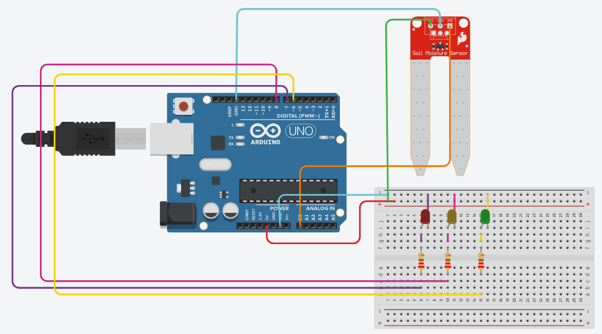
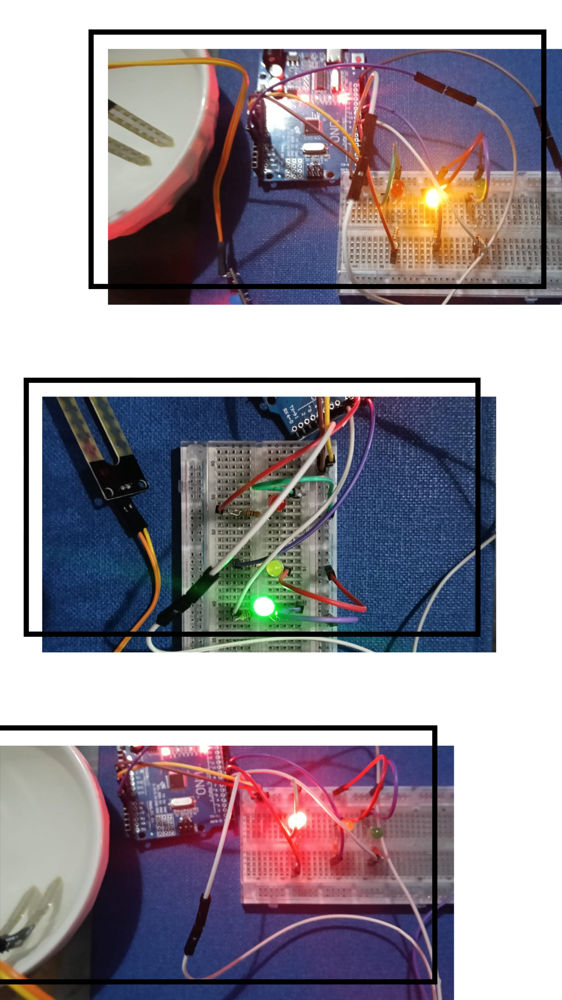

# Sistema-para-el-riesgo-de-humedad-extrema-o-escasa-en-las-plantas
Sistema embebido con Arduino UNO para monitoreo de humedad en plantas usando sensor resistivo y LEDs indicadores.

## Descripción

Proyecto de Circuitos Digitales realizado en la Universidad de San Buenaventura, para realizar un sistema embebido con Arduino UNO para monitorear la humedad en plantas domésticas mediante un sensor de humedad y LEDs indicadores.

## Problemática

Aborda el riego inadecuado en hogares y huertos urbanos, una problemática causada por la falta de tiempo o conocimiento que provoca la muerte de las plantas por estrés hídrico o exceso de agua, además de un desperdicio del recurso. Este proyecto busca automatizar el monitoreo de humedad para facilitar el cuidado de las plantas y promover el uso eficiente del agua.

## Integrantes

- Sofía Socha
- Valentina Cruz
- Mariana Javier
- Alejandra Triana

## Componentes utilizados

- Arduino UNO
- Sensor de humedad resistivo
- LEDs indicadores
- Resistencias de 220Ω
- Protoboard
- Cables jumper
  
## Instrucciones de uso

Para ejecutar el proyecto es necesario conectar el sensor de humedad al pin analógico A0 del Arduino UNO y los LEDs indicadores a los pines digitales 6, 7 y 8 mediante resistencias de 220 Ω. Posteriormente, se debe cargar el archivo del código desde Arduino IDE utilizando un cable USB conectado al computador. Una vez cargado el programa, el sistema comenzará a leer continuamente los valores de humedad detectados por el sensor y activará automáticamente el LED correspondiente según el nivel registrado. Para replicar el montaje físico se recomienda seguir el diagrama de conexiones incluido en este repositorio. 

## Funcionamiento

1. Ubicar el sensor en la maceta de la planta.
2. El sensor detecta el nivel de humedad.
3. El Arduino procesa la lectura analógica.
4. Dependiendo del valor:
   - LED rojo -> Humedad a temperatura caliente
   - LED amarillo -> Humedad a temperatura media
   - LED verde -> No hay humedad
     
  ## Código fuente
  
   El código principal se encuentra en:

```bash 
codigo/proyecto_final.ino
```

## Diagrama del circuito



## Evidencia del sistema




## Video demostrativo

Link del video:

PEGUEN_AQUI_EL_LINK

## Informe IEEE

El informe técnico completo se encuentra en:

```bash
PROYECTO_CIRCUITOS.pdf
```
